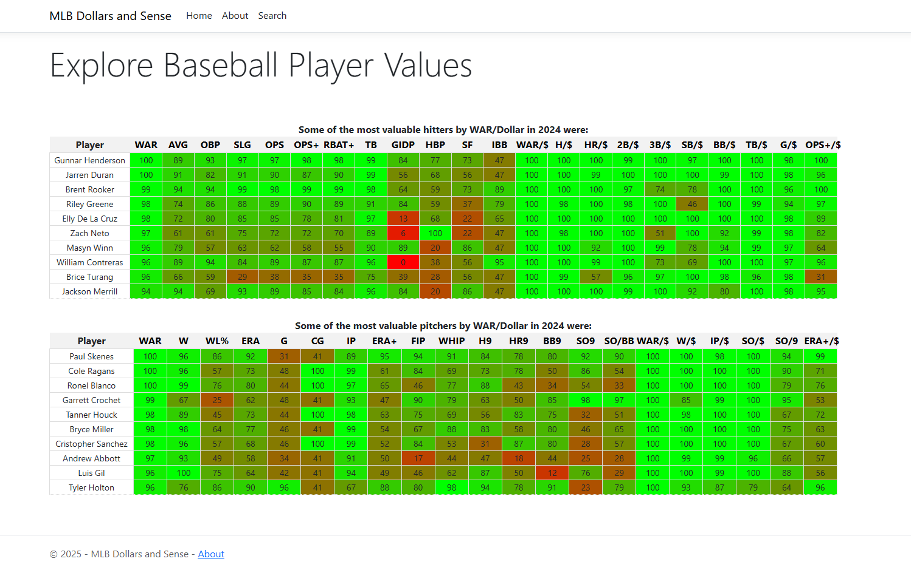
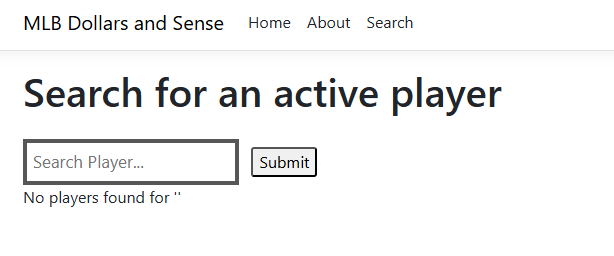
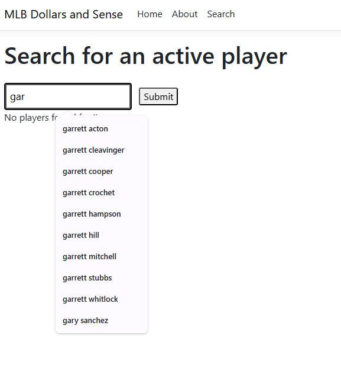
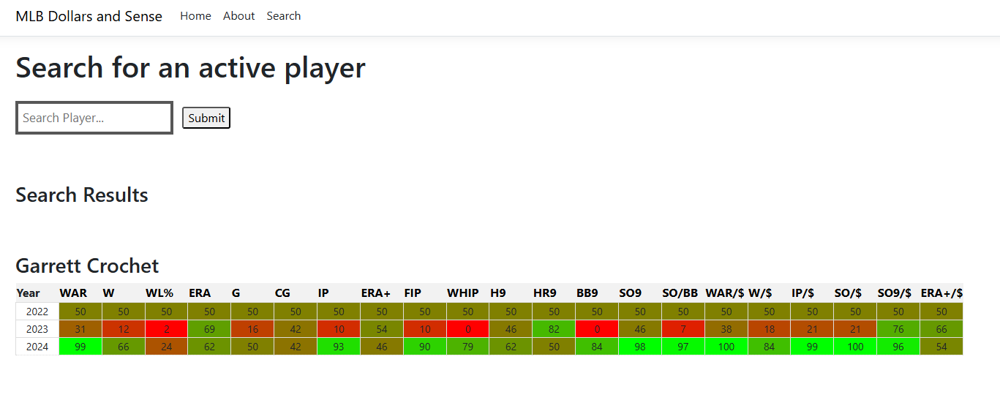

### General Overview

The application is comprised of two basic parts: 1. Data Collection and Analysis 2. .NET Application Interface.

The first part, the data collection, can be found in the scrapers directory and is composed of methods for scraping data from Baseball Reference and data from the Cot's salary data sheet. 

The second part is the main application in the ASP.NET framework. The layout uses Razor pages to manage the frontend and backend of the application. 

### Startup
The user should ensure that they have .NET capability installed, preferably with Visual Studio Code. See https://dotnet.microsoft.com/en-us/download for .NET. The application uses SQLite to manage the database, ensure that it is installed on the project via:

```dotnet add package Microsoft.EntityFrameworkCore.Sqlite```

To start the application navigate to the root of the application BaseballApp and run:

```dotnet run```

### Application Overview
When a user starts the application they are greeted by the home page which contains top performing baseball players by value for the year 2024. This page is split into the top batters on the top and the top pitchers on the bottom. 


The rows are headeed by the statistical category pertaining to each column. The statistical categories on the left side of the table are traditional statistics such as battting average, home runs, earned run average, etc. The categories on the right are the value that a player provides in that facet relative to their yearly salary.

A user can navigate to the search page through the top bar where they will be greeted by an empty search bar.


Upon typing into the bar, the user will be given autocomplete results for players whose first name starts with that query. It should be noted that all players are entered into the database with their names written in standard english characters. For example the player "Julio Rodríguez" will be present in the database as "Julio Rodriguez" and the accented i is not recognized.


When a desired player is found, their yearly statistical data is listed in row column format for the years that they were active between 2022-2024. The column headers at the top indicate the statistical category. The number present in the cell indicates the percentile ranking that the player achieved for that category relative to his peers. The color of the cell background corresponds to a place on the red-green spectrum with red corresponding to the lowest percentile ranking and green representing the highest.



### Data Methodology
Currently active MLB players were scraped from Baseball Reference through their all players page: All Players. The players are listed alphabetically with currently active players (as of 2024) in bold text. These players, along with the links to their player page were saved. For each player, either their standard batting or standard pitching table was scraped and their yearly statistical values were stored according to their year. The statistics included WAR, batting average, home runs, wins, earned run average and strikeouts among other basic statistics. Yearly data was only scraped for the years 2022-2024. This was done as a means to ensure higher completeness due to the constraint of the players being currently active.

The statistical data was then merged with salary information from the Cot's player salary data. Cot's is a clearinghouse for MLB salary and payroll and provides excel sheets for player salary data on MLB's Opening Day. The data was robust, but any incomplete data was replaced with the yearly league minimum salary from the corresponding year. This was a fair but imperfect assumption. If a player did not have a salary on opening day, there was a high likelihood that he was called up from the minor leagues during the year and would earn the league minimum salary.

To attain player value, the statistical data was divided by the salary data player-wise and year-wise. This gave a value of statistic/dollar (e.g. WAR/$). For each statistical category, and the derivative categories relative to salary, the z-score was computed ((mean - data) / standard deviation). For certain categories (ERA, batter strikeouts) the sign was inverted to signal that a negative z-score was a good thing.